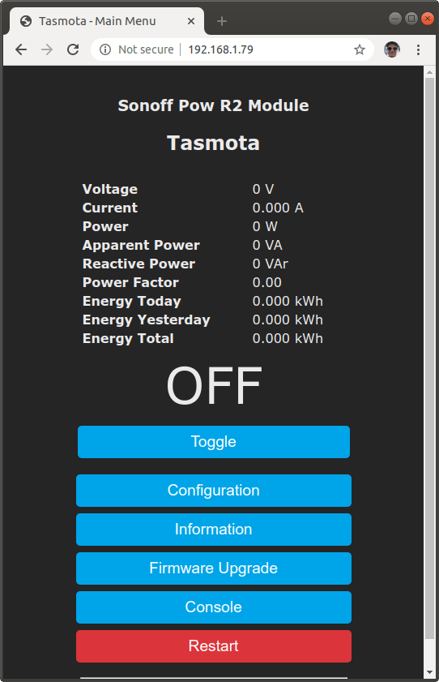

# Flashing Sonoff Pow R2

These are my TLDR instructions for flashing the device, nevertheless, you should RTFM first:

* https://github.com/arendst/Tasmota/wiki/sonoff-pow-r2
* https://github.com/arendst/Tasmota/wiki/Flashing

Start by installing [esptool.py](https://github.com/espressif/esptool):

```bash
python3 -m pip install esptool
esptool.py version # NB mine showed v2.8.
```

**Then unplug the sonoff device from the MAINS AC power**.

Connect the usb-to-serial to the sonoff device as described in its manual (you can see [my module documentation](usb-to-serial-ftdi-module.jpg)).

Put the sonoff device in programming mode by unplugging the usb-to-serial
from the computer, then, while pressing the physical toggle button on the
sonoff device plug it again and wait about 5s.

Make sure you can use the linux device that represents your usb-to-serial module, `/dev/ttyUSB0` in my case:

```bash
sudo chgrp `id -g` /dev/ttyUSB0
```

Verify that the sonoff device was put in programming mode:

```bash
sudo chgrp `id -g` /dev/ttyUSB0
esptool.py -p /dev/ttyUSB0 flash_id
```

It should return something like my sonoff pow r2:

```plain
esptool.py v2.8
Serial port /dev/ttyUSB0
Connecting....
Detecting chip type... ESP8266
Chip is ESP8266EX
Features: WiFi
Crystal is 26MHz
MAC: a4:cf:12:b6:16:9d
Uploading stub...
Running stub...
Stub running...
Manufacturer: ef
Device: 4016
Detected flash size: 4MB
Hard resetting via RTS pin...
```

Put the sonoff device in programming mode again.

Flash it with the tasmota firmware:

```bash
wget -Otasmota-8.1.0.bin https://github.com/arendst/Tasmota/releases/download/v8.1.0/tasmota.bin
sudo chgrp `id -g` /dev/ttyUSB0
esptool.py --port /dev/ttyUSB0 write_flash --erase-all --flash_mode dout --flash_size 4MB 0x0 tasmota-8.1.0.bin
```

This should display something like my sonoff pow r2:

```plain
esptool.py v2.8
Serial port /dev/ttyUSB0
Connecting....
Detecting chip type... ESP8266
Chip is ESP8266EX
Features: WiFi
Crystal is 26MHz
MAC: a4:cf:12:b6:16:9d
Uploading stub...
Running stub...
Stub running...
Configuring flash size...
Erasing flash (this may take a while)...
Chip erase completed successfully in 6.0s
Flash params set to 0x0340
Compressed 580480 bytes to 399923...
Wrote 580480 bytes (399923 compressed) at 0x00000000 in 35.1 seconds (effective 132.2 kbit/s)...
Hash of data verified.

Leaving...
Hard resetting via RTS pin...
```

Unplug the usb-to-serial module from the computer and sonoff.

Put the cover case in your sonoff device.

Connect the sonoff to mains AC power.

Find the `tasmota-xxxx` wifi network and connect to it. Then open the [tasmota configuration](https://github.com/arendst/Tasmota/wiki/Initial-Configuration) address at http://192.168.4.1.

Configure your WiFi credentials.

Once it connects to your WiFi network, find its IP address in your router management interface by looking at the one that has the MAC address or the tasmota-xxxx host. In my case it was at 192.168.1.79, so the configuration should continue at http://192.168.1.79.

You should now change the module type to Sonoff Pow R2, disable MQTT, set the web password, etc.

The tasmota home page should now be something alike:



That page shows the data that corresponds to the following [HTTP API Commands](https://tasmota.github.io/docs/#/Commands).

Get the device module name:

    http://192.168.1.79/cm?cmnd=Module

```json
{
    "Module": {
        "43": "Sonoff Pow R2"
    }
}
```

Get the device friendly name:

    http://192.168.1.79/cm?cmnd=FriendlyName

Which returns:

```json
{
    "FriendlyName1": "Tasmota"
}
```

Get the sensors data:

    http://192.168.1.79/cm?cmnd=Status%208

Which returns:

```json
{
    "StatusSNS": {
        "Time": "2020-01-28T20:56:51",
        "ENERGY": {
            "TotalStartTime": "2020-01-28T20:21:32",
            "Total": 0,
            "Yesterday": 0,
            "Today": 0,
            "Power": 0,
            "ApparentPower": 0,
            "ReactivePower": 0,
            "Factor": 0,
            "Voltage": 0,
            "Current": 0
        }
    }
}
```

Get the relay state:

    http://192.168.1.79/cm?cmnd=Power0

Which returns:

```json
{
    "POWER": "OFF"
}
```

## Sonoff Basic

The programming process is alike the sonoff pow r2, except for the memory size.

Start by confirming the hardware:

```bash
sudo chgrp `id -g` /dev/ttyUSB0
esptool.py -p /dev/ttyUSB0 flash_id
```

```plain
esptool.py v2.8
Serial port /dev/ttyUSB0
Connecting....
Detecting chip type... ESP8266
Chip is ESP8285
Features: WiFi, Embedded Flash
Crystal is 26MHz
MAC: 2c:f4:32:c2:b7:5d
Uploading stub...
Running stub...
Stub running...
Manufacturer: 51
Device: 4014
Detected flash size: 1MB
Hard resetting via RTS pin...
```

Then flash it:

```bash
wget -Otasmota-8.1.0.bin https://github.com/arendst/Tasmota/releases/download/v8.1.0/tasmota.bin
sudo chgrp `id -g` /dev/ttyUSB0
esptool.py --port /dev/ttyUSB0 write_flash --erase-all --flash_mode dout --flash_size 1MB 0x0 tasmota-8.1.0.bin
```

```plain
esptool.py v2.8
Serial port /dev/ttyUSB0
Connecting....
Detecting chip type... ESP8266
Chip is ESP8285
Features: WiFi, Embedded Flash
Crystal is 26MHz
MAC: 2c:f4:32:c2:b7:5d
Uploading stub...
Running stub...
Stub running...
Configuring flash size...
Erasing flash (this may take a while)...
Chip erase completed successfully in 3.6s
Compressed 580480 bytes to 399923...
Wrote 580480 bytes (399923 compressed) at 0x00000000 in 35.1 seconds (effective 132.2 kbit/s)...
Hash of data verified.

Leaving...
Hard resetting via RTS pin...
```
